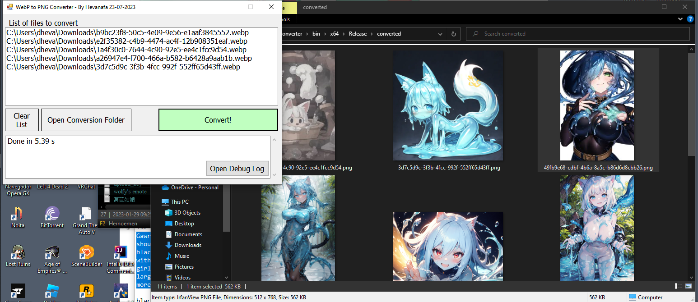

# WEBP Converter

By Hevanafa, 24-07-2023

A simple WEBP to PNG converter written in VB .NET and Rust.

This project uses VB .NET as the frontend and Rust as the conversion library.

## Prerequisites

1. Install Rust toolchain,
2. Change to nightly for faster builds: `rustup default nightly`,
3. Install Visual Studio 2019 Community Edition (or newer).

## How to build

1. Build `library` with the script "build.ps1",
2. Copy `library.dll` to the root project folder,
3. Open WEBPConverter.vbproj,
4. Add `library.dll` to the VB project,
5. Click `library.dll` in Project Explorer,
6. In the Properties panel, change "Build action" to "None" and change "Copy to output directory" to "Copy if newer",
7. Change the build profile to Release,
8. Build

